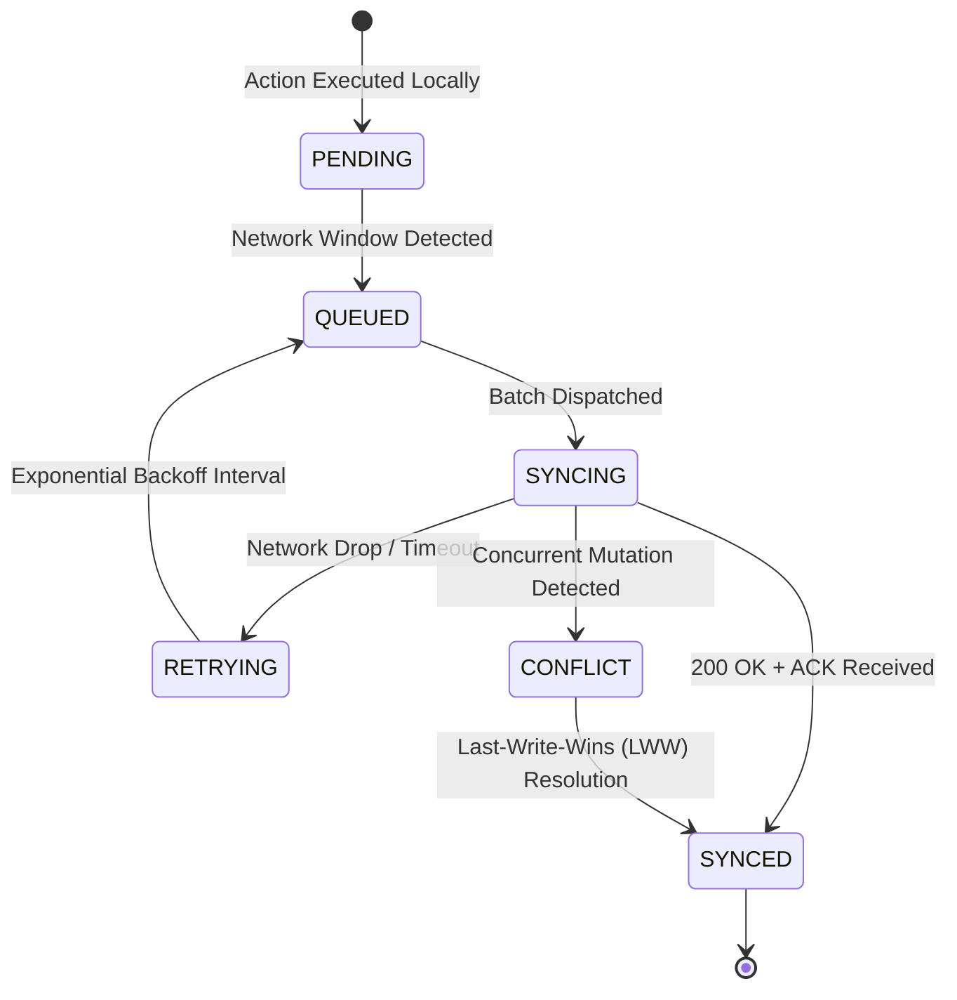

# Offline Synchronization Architecture & Conflict Resolution

## 1. Synchronization Lifecycle

Every operation executed offline follows a strict state transition model:

---

## 2. Idempotency & Duplicate Prevention

In high-latency or intermittent cellular environments, requests may succeed on the server while the returning acknowledgment drops on the radio link. To eliminate duplicate record creation:

1. **Client-Assigned UUIDs**: Each offline action is assigned an immutable `client_record_id` (UUID v4) prior to network transmission.
2. **Server-Side Unique Index**: The backend maintains a unique constraint on `sync_records.client_record_id`.
3. **Idempotent Acknowledgment**: When receiving a batch containing an already-processed `client_record_id`, the backend skips re-inserting the quiz or progress record and immediately returns the ID in `processed_ids` with `ACK_OK`.

---

## 3. Conflict Resolution Strategy

### Learning Progress & Module Status
- Handled using **Last-Write-Wins (LWW)** based on client-generated UTC ISO-8601 timestamps, preferring the higher completion score between conflicting submissions.

### Student Latent Ability ($\theta$) & Mastery
- Latent ability is updated sequentially using the chronological item response vector, ensuring that out-of-order synchronizations converge deterministically to the correct posterior distribution.
