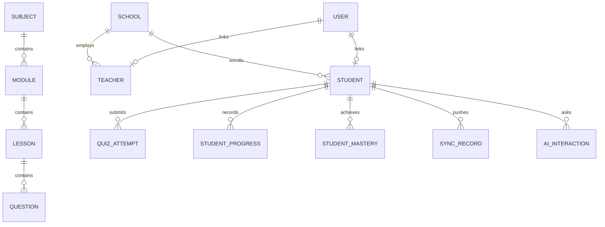

# Central Database Schema (PostgreSQL)

## 1. Entity-Relationship Overview

The central database serves as the persistent multi-tenant record store for schools, teachers, students, curriculum versioning, and synchronization histories.

---

## 2. Table Specifications

### `students`
- `id` (VARCHAR(50), PK): Student identifier (e.g. `STU101`).
- `user_id` (VARCHAR(36), FK): Optional link to auth user.
- `school_id` (VARCHAR(36), FK): Enrolled school identifier.
- `name` (VARCHAR(255)): Full student name.
- `grade` (INTEGER): Academic grade level (6-8).
- `language` (VARCHAR(50)): Primary learning language (`urdu`, `english`, `sindhi`).
- `learning_band` (VARCHAR(20)): Current pedagogical band (`REMEDIAL`, `ON_TRACK`, `ADVANCED`).
- `overall_mastery` (FLOAT): Calibrated logistic mastery score ($0.0 - 1.0$).
- `theta_ability` (FLOAT): IRT latent ability parameter $\theta$ ($-3.0 \text{ to } +3.0$).
- `last_active_at` (DATETIME): Last recorded learning interaction timestamp.

### `sync_records`
- `id` (VARCHAR(36), PK): Server-side primary key.
- `client_record_id` (VARCHAR(100), UNIQUE): Client-assigned UUID for idempotency.
- `student_id` (VARCHAR(50), FK): Student who authored the mutation.
- `operation_type` (VARCHAR(50)): Operation type (`REG`, `PROGRESS`, `QUIZ`, `AI_CHAT`).
- `payload_json` (JSON): Raw payload object.
- `status` (VARCHAR(20)): Sync state (`SYNCED`, `CONFLICT`).
- `synced_at` (DATETIME): Server acknowledgment timestamp.

### `sms_messages`
- `id` (VARCHAR(36), PK): Message audit identifier.
- `direction` (VARCHAR(20)): `INBOUND` or `OUTBOUND`.
- `sender_number` (VARCHAR(50)): Caller MSISDN phone number.
- `raw_text` (TEXT): Delimited SMS payload.
- `student_id` (VARCHAR(50)): Parsed student identifier.
- `action_code` (VARCHAR(10)): `REG`, `QZ`, `ASK`, `PGR`.
- `status` (VARCHAR(20)): `PROCESSED`, `ERROR`, `SIMULATED`.
- `response_text` (TEXT): Outbound reply SMS.
